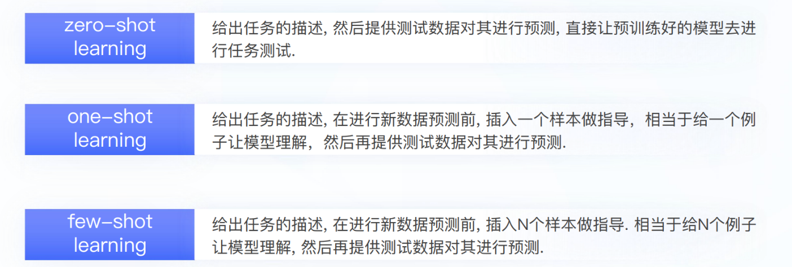
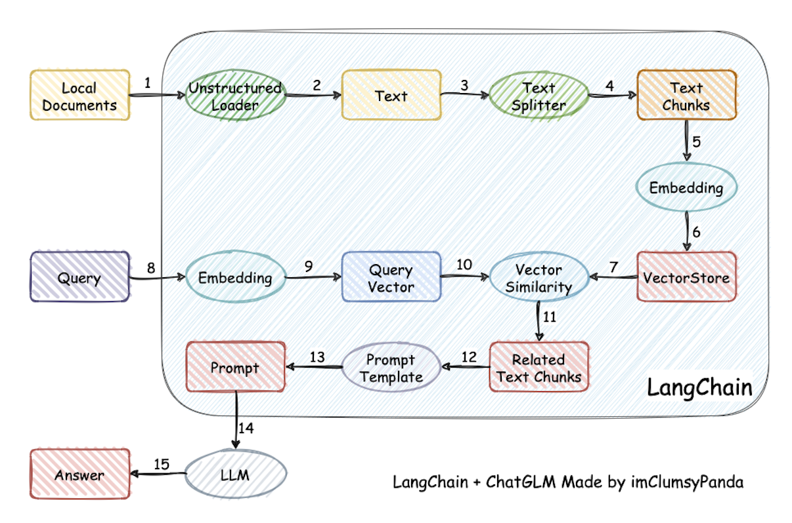
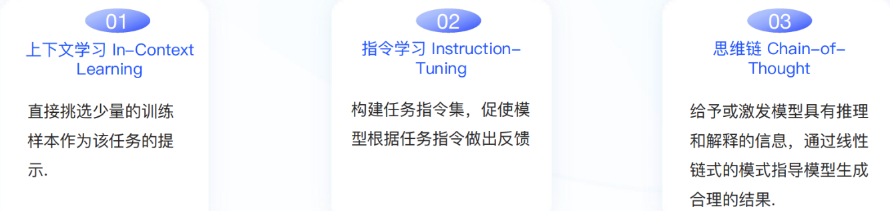
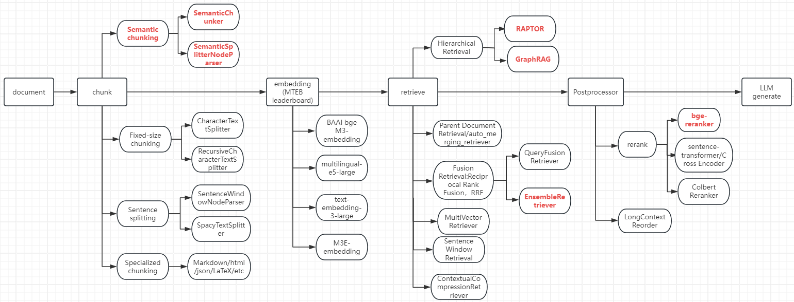
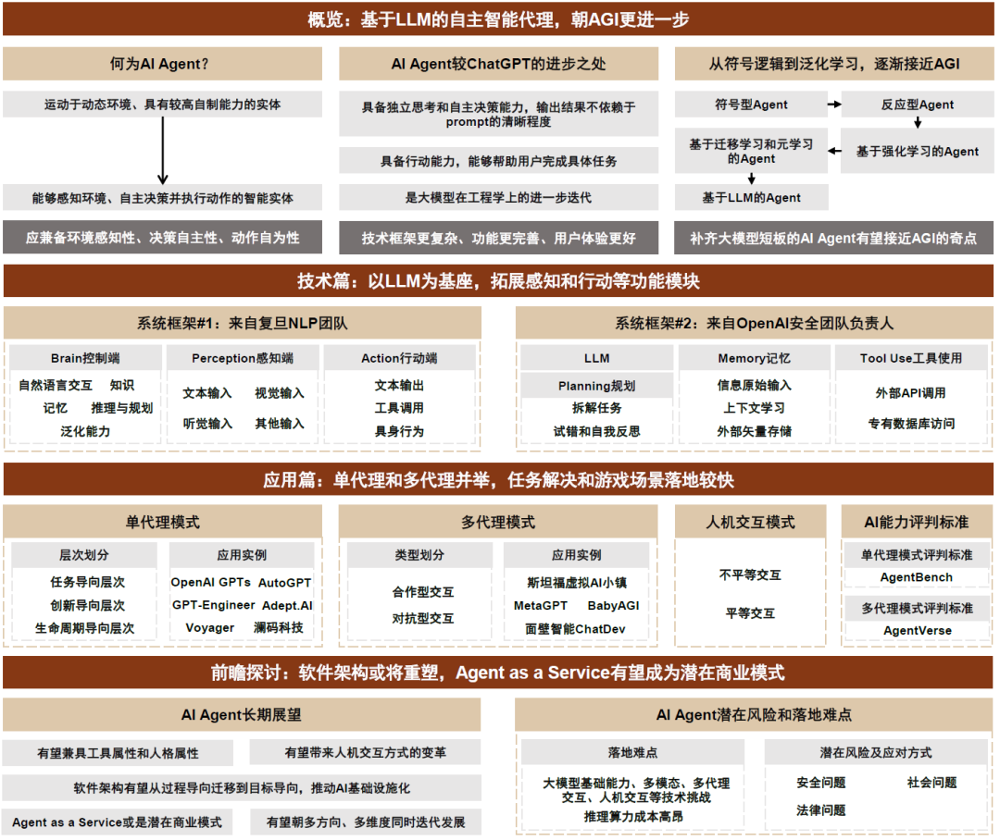
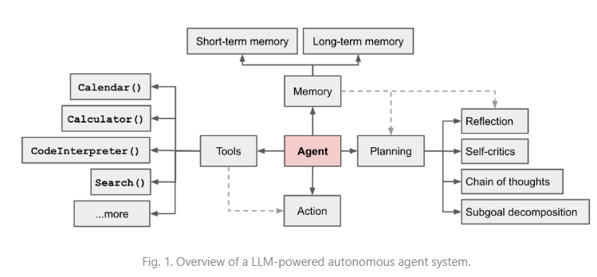

> 建议直接看省流版


[toc]
### 综述

<div align=center>

</div>

### 大模型能力探究

#### In Context Learning 

`In-Context learning（ICL）`最早在`GPT3`中提出, 旨在从训练集中挑选少量的标注样本，设计任务相关的指令形成提示模板，用于指导测试样本生成相应的结果，有以下三种学习方式。


#### 涌现能力

#### 能力评估

#### 领域能力


### Transformer

#### Transformer 工作原理

> 参见 [什么是 GPT？Transformer 工作原理的动画展示](https://arthurchiao.art/blog/visual-intro-to-transformers-zh/)


> 更多可查看
> 
> - [Transformer模型详解（图解最完整版](https://zhuanlan.zhihu.com/p/338817680)
> - [OpenAI ChatGPT（一）：十分钟读懂 Transformer](https://zhuanlan.zhihu.com/p/600773858)
> - [Transformer的结构是什么样的？各个子模块各有什么作用？](https://blog.csdn.net/m0_54929869/article/details/118881804)
> - [以Transformer结构为基础的大模型参数量、计算量、中间激活以及KV cache剖析](https://mp.weixin.qq.com/s/3JYz6yrLeBr5ujip3LZe6w)
> - [Transformer 一起动手编码学原理](https://mp.weixin.qq.com/s/NgUNuWhvp2SqG-XWYv2PGQ)
> - [为什么transformer(Bert)的多头注意力要对每一个head进行降维？](http://www.sniper97.cn/index.php/note/deep-learning/note-deep-learning/4002/)


#### Transformer 实现

> 参见 [Transformer 是如何工作的：600 行 Python 代码实现 self-attention 和两类 Transformer](https://arthurchiao.art/blog/transformers-from-scratch-zh/)

---
<details>

<summary>代码如下</summary>

**`text classification transformer`** 的`python`实现

    ```python
    class Transformer(nn.Module):
    def __init__(self, k, heads, depth, seq_length, num_tokens, num_classes):
        super().__init__()

        self.num_tokens = num_tokens
        self.token_emb = nn.Embedding(num_tokens, k)
        self.pos_emb = nn.Embedding(seq_length, k)

        # The sequence of transformer blocks that does all the heavy lifting
        tblocks = []
        for i in range(depth):
            tblocks.append(TransformerBlock(k=k, heads=heads))
        self.tblocks = nn.Sequential(*tblocks)

        # Maps the final output sequence to class logits
        self.toprobs = nn.Linear(k, num_classes)

    def forward(self, x):
        """
        :param x: A (b, t) tensor of integer values representing words (in some predetermined vocabulary).
        :return: A (b, c) tensor of log-probabilities over the classes (where c is the nr. of classes).
        """
        # generate token embeddings
        tokens = self.token_emb(x)
        b, t, k = tokens.size()

        # generate position embeddings
        positions = torch.arange(t)
        positions = self.pos_emb(positions)[None, :, :].expand(b, t, k)

        x = tokens + positions # 为什么文本嵌入和位置嵌入相加，没有理论，可能就是实验下来效果不错。
                               # https://writings.stephenwolfram.com/2023/02/what-is-chatgpt-doing-and-why-does-it-work/
        x = self.tblocks(x)

        # Average-pool over the t dimension and project to class
        # probabilities
        x = self.toprobs(x.mean(dim=1))
        return F.log_softmax(x, dim=1)
    ```

</details>

---

> 更多可查看
> 
> - [OpenAI ChatGPT（一）：Tensorflow实现Transformer](https://zhuanlan.zhihu.com/p/603243890)
> - [OpenAI ChatGPT（一）：十分钟读懂 Transformer](https://zhuanlan.zhihu.com/p/600773858)
> - [GPT （一）transformer原理和代码详解](https://zhuanlan.zhihu.com/p/632880248)
> - [Transformer源码详解（Pytorch版本）](https://zhuanlan.zhihu.com/p/398039366)
> - [搞懂Transformer结构，看这篇PyTorch实现就够了](https://zhuanlan.zhihu.com/p/339207092)


### 主流LLMS和预训练

<div align=center>

</div>


### Prompt Tunning范式




Prompt-Tuning方法是一种用于改进语言模型的训练方法，是由谷歌提出的一种轻量级的优化方法。在语言模型中，Prompt是一个前缀文本，用于指导生成的文本内容。Prompt-Tuning方法通过对Prompt进行优化，使其能够更好地引导模型生成符合预期的文本。

- 基于Fine-Tuning的方法是让预训练模型去迁就下游任务，
- 基于Prompt-Tuning的方法可以让下游任务去迁就预训练模型, 其目的是将Fine-tuning的下游任务目标转换为Pre-training的任务.

#### Tunning Free Prompt
#### Fix-Prompt LM Tunning
#### Fix-LM Prompt Tunning
#### Fix-LM Adapter Tunning
#### Representation Tuning


### 指令微调&对齐 (instruction_tunning)

#### 经典方案
#### SFT数据Scaling Law
#### 新对齐/微调方案
#### 指令数据生成
#### 如何降低通用能力损失
#### 微调经验/实验报告


### 对话模型

### 思维链 (prompt_chain_of_thought)
思维链方法的核心思想是将思考的过程及其相关的观念和想法串联起来，形成一个连续的思维链条。这种链条可以由线性或非线性的思维过程构成，从而帮助模型不断延伸和扩展思考。相比于之前传统的上下文学习（即通过x1,y1,x2 ,y2 ,....xtest作为输入来让大模型补全输出ytest），思维链多了中间的推导提示.

#### 原理分析
#### 基础&进阶用法
#### 非传统COT问题分解方向
#### 分领域COT [Math, Code, Tabular, QA]


### RLHF
#### Deepmind
#### openai
#### Inference Scaling
#### 改良方案
#### RL探究

### RAG

#### 相关工作总结

****


#### 相关技术要点



#### 技术框架


#### RAG 研究热点


#### RAG 的挑战
- 长上下文
- 与FT的协同
- 如何应用好LLM，充分挖掘利用LLM
- 提升鲁棒性，比如如何处理错误的召回内容，如何过滤和验证召回内容
- RAG 是否也遵循Scaling Law
- 最佳工程实践，比如提升在大数据量下的检索延迟，如何保障隐私的检索内容不被LLM泄露


#### 多模态扩展
将RAG从文本扩展到多模态


#### RAG 开发生态建设
扩展RAG下游任务，改善生态建设


#### RAG 技术栈与工业界实践
当前有`LangChain`、`LlamaIndex`、`AutoGen`等流行的开发框架，可以方便开发RAG应用。


工业界也有很多RAG应用。


[RAG详细代码](https://github.com/langchain-ai/rag-from-scratch/tree/main)(路径：LLM\rag-from-scratch-main)


### LLM Agent 让模型使用工具 (llm_agent)



- 具备独立思考和自主决策的能力，
- 输出结果不依赖于prompt的清晰程度

**AI Agent = LLM大模型 + Planning规划 + Memory记忆 + Tool Use工具使用**



#### 基于prompt通用方案
#### 基于微调通用方案
#### 调用模型方案
#### 垂直领域
#### 评估
#### MultiAgent
#### 自主学习和探索进化

### 大模型图表理解和生成
#### survey
#### prompt 
#### fintuning
#### multimodal


### LLM+KG
#### 综述类
#### KG用于大模型推理
#### 大模型用于KG构建


### Humanoid Agents


### pretrain_data & pretrain


### 领域模型SFT(domain_llms)


### LLM超长文本处理 (long_input)
#### 位置编码、注意力机制优化
#### 上文压缩排序方案
#### 训练和模型架构方案
#### 效率优化

### LLM长文本生成（long_output）


### NL2SQL
#### 大模型方案
#### Domain Knowledge Intensive
#### others


### Code Generation


### 降低模型幻觉 (reliability)
#### Survey 
#### Prompt or Tunning
#### Decoding Strategy
#### Probing and Detection
#### Reviewing and Calibration


### 大模型评估（evaluation）
#### 事实性评估
#### 检测任务

### 推理优化(inference)


### 模型知识编辑黑科技(model_edit)


### 模型合并和剪枝(model_merge)


### MOE


### Other Prompt Engineer(prompt_engineer)


### Multimodal


### Timeseries LLM


### Quanization


### Adversarial Attacking


### Others


### LLM资源合集

#### 论文
[论文合集](https://github.com/asimsinan/LLM-Research/blob/main/Papers.md)(截止2024/9/26)

#### 课程

[课程合集](https://github.com/asimsinan/LLM-Research/blob/main/UniversityCourses.md)：

#### 框架

[框架合集](https://github.com/asimsinan/LLM-Research/blob/main/ToolsFrameworks.md)


#### 模型
[模型汇总](https://github.com/DSXiangLi/DecryptPrompt/blob/main/%E5%BC%80%E6%BA%90%E6%A8%A1%E5%9E%8B.MD)


#### 数据

[开源数据](https://github.com/DSXiangLi/DecryptPrompt/blob/main/%E5%BC%80%E6%BA%90%E6%95%B0%E6%8D%AE.MD)


